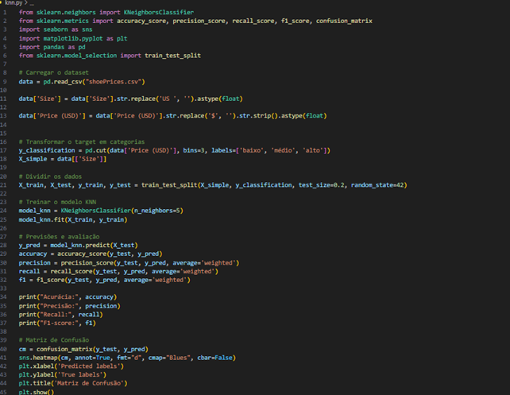
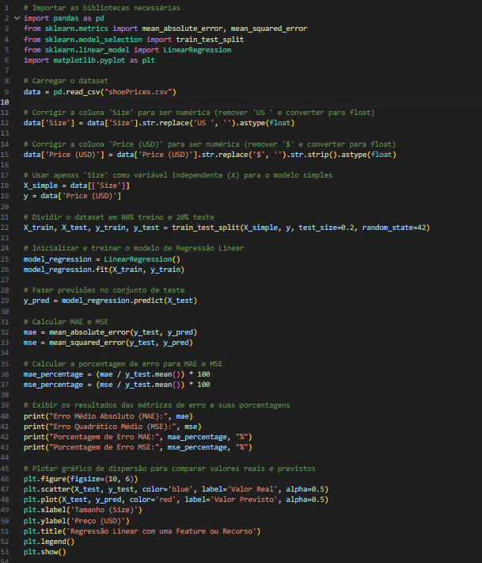

# Aprendizado de maquina

## KNN (K-Nearest Neighbor):

O KNN (K-Nearest Neighbors) é um algoritmo de aprendizado de máquina baseado em instâncias. Ele é usado principalmente para classificação e regressão, sendo um dos métodos mais simples e intuitivos no aprendizado supervisionado. Aqui está um resumo de como ele funciona:

## Regressão Linar:

A Regressão Linear é uma técnica de aprendizado supervisionado usada para modelar a relação entre uma variável dependente (ou alvo) e uma ou mais variáveis independentes (ou preditoras). O objetivo é encontrar uma linha reta (ou hiperplano em dimensões mais altas) que melhor represente a relação entre as variáveis.

## Imagens

### KNN (K-Nearest Neighbor):

[código de regressão linear](codigos/knn.py)

### Regressão Linar:

[código de regressão linear](codigos/regresaoL.py)
